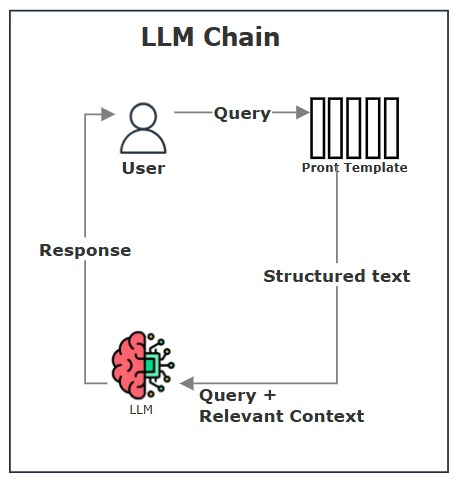

# Lab 8 AREP / LLM Chain

Este documento proporciona una guía detallada sobre el uso de LLMChain en LangChain para construir cadenas de procesamiento con modelos de lenguaje (LLMs).

Para clonar el proyecto 

git clone  ´ https://github.com/lalaro/Taller8AREP.git ´

### Prerrequisitos

Se necesita instalar las siguientes herramientas antes de comenzar:

1. Python 3.8 o superior.

2. OpenAI API Key (u otra API compatible con LangChain).

3. Instalar LangChain y dependencias necesarias con:

` pip install langchain openai `

## Arquitectura



Esta arquitectura representa el flujo de una LLM Chain, un sistema basado en modelos de lenguaje grandes (LLM) para responder consultas de los usuarios de manera estructurada. El proceso comienza cuando el usuario envía una query, que puede ser una pregunta o una solicitud de información. Luego, esta consulta pasa por un Prompt Template, que la estructura para que el modelo de lenguaje la procese de manera más eficiente. A partir de esto, se genera un structured text, que es una versión más clara y organizada del input original.

Este texto estructurado se envía al LLM, que recibe la consulta y, si el sistema lo permite, también obtiene un contexto relevante adicional para mejorar la respuesta. Con esta información, el LLM genera una respuesta basada en la consulta y el contexto disponible. Finalmente, la respuesta es devuelta al usuario.

Este flujo es típico de los sistemas LLM Chain, pero si se complementa con información recuperada desde una base de datos vectorial (Vector DB, como Pinecone), se convierte en una arquitectura RAG (Retrieval-Augmented Generation), que permite enriquecer las respuestas con información más precisa y actualizada.

## Uso de LLMChain

Para ejecutar la cadena y obtener una respuesta del modelo de lenguaje:

```python
response = chain.run("inteligencia artificial")
print(response)
```

## Construido con

* [LangChain]() - Framework para construir aplicaciones con LLMs.
* [OpenAI](https://platform.openai.com/docs/concepts) - API para modelos de lenguaje.
* [Python](https://docs.python.org/3/) - Lenguaje de programación.

## Contribuyendo

Por favor, lee [CONTRIBUTING.md](https://gist.github.com/PurpleBooth/b24679402957c63ec426) para detalles sobre nuestro código de conducta y el proceso para enviarnos solicitudes de cambios (*pull requests*).

## Versionado

Usamos [SemVer](http://semver.org/) para el versionado.

## Autores

* **Laura Valentina Rodríguez Ortegón** - *Lab8 AREP LLM * - [Repositorio](https://github.com/lalaro/Taller8AREP.git)

## Licencia

Este proyecto está licenciado bajo la Licencia MIT - consulta el archivo [LICENSE.md](LICENSE.md) para más detalles.

## Reconocimientos

* Agradecimientos a la Escuela Colombiana de Ingeniería
* La documentación de Git Hub
* Al profesor Luis Daniel Benavides
